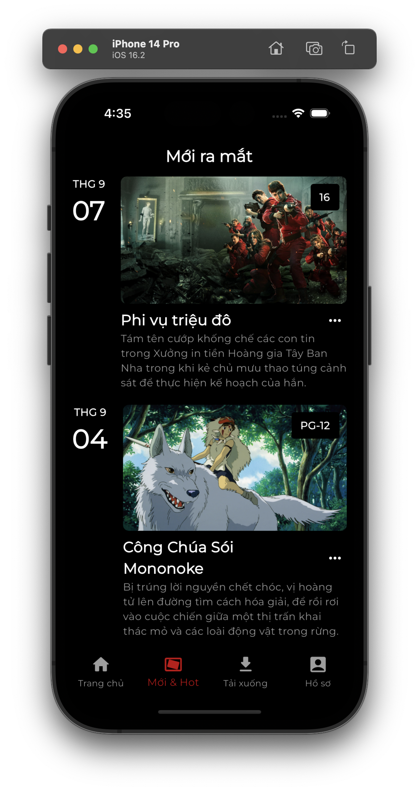
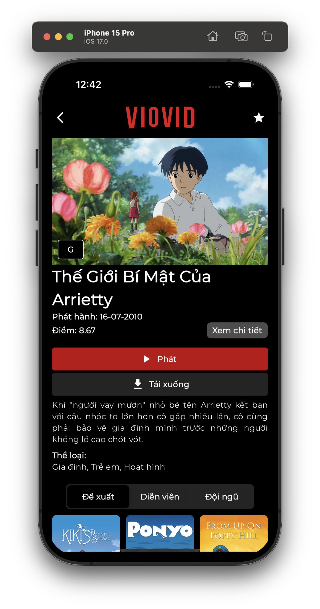
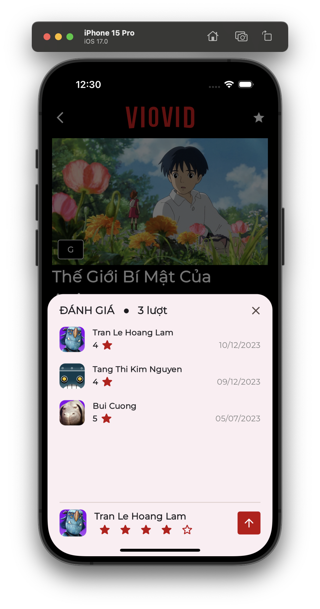

    
    

    

# Movie App

SE121.011

## Reference

1. Flutter
2. Bloc Cubit
3. Supabase
4. The Movie Database - TMDB

### Screenshots

- Onboarding

    
    

- Video Play

    

- NavScreen

    
    

    

- Film deital

    
    

- Search Film

    
    

- Person deital

    

